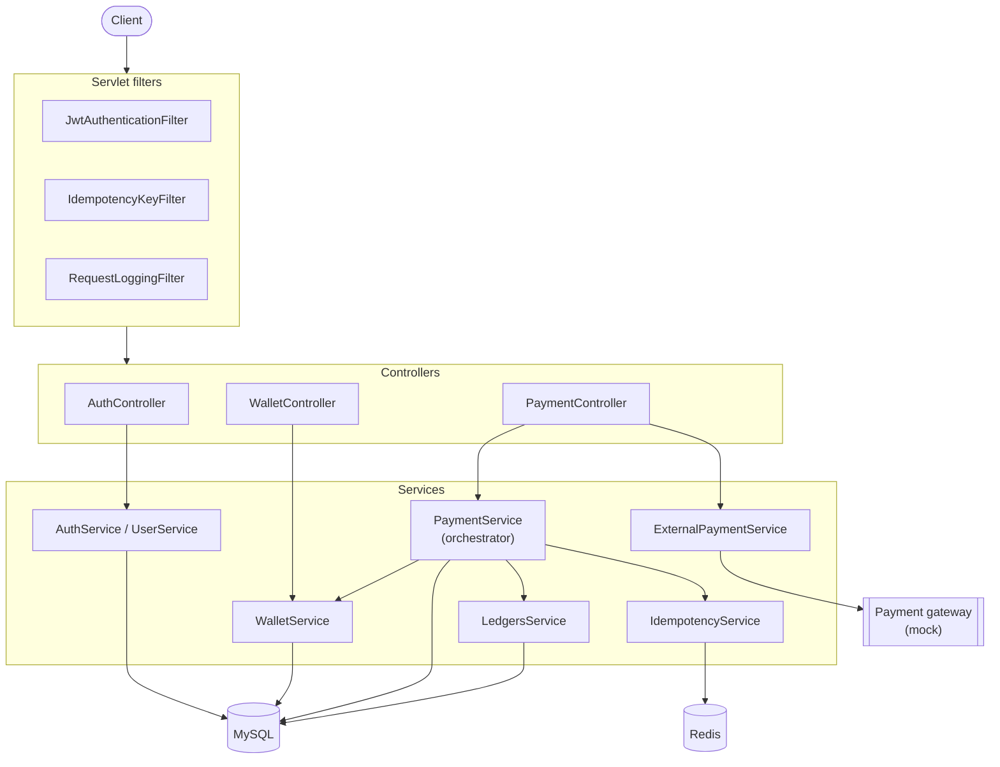
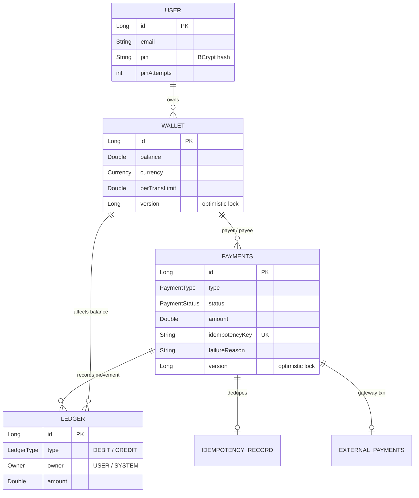
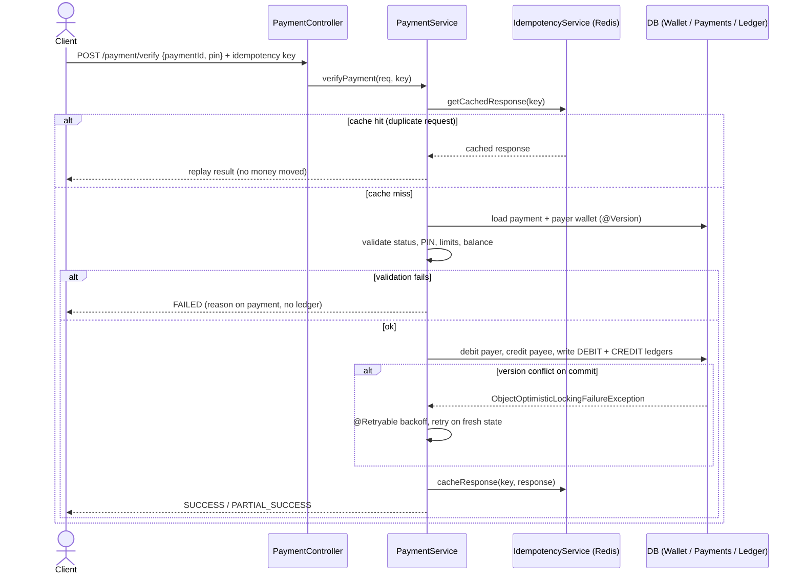
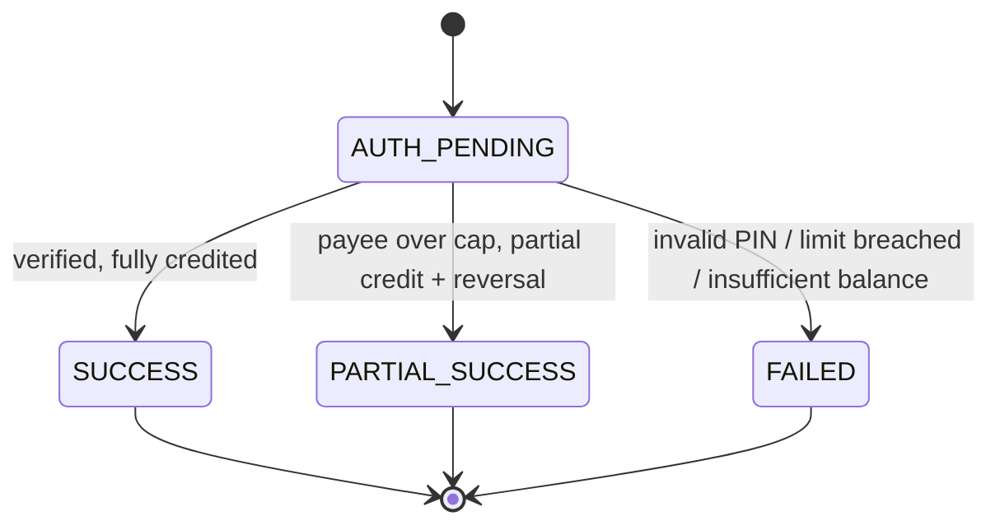

# Payment Service & Ledger

[](https://github.com/HitanshiK/Payment-Service/actions/workflows/ci.yml)

A Spring Boot wallet-payment backend with a double-entry ledger. It handles
internal wallet-to-wallet payments, external top-ups and payouts through a
payment gateway, PIN-protected authorization, and a full audit trail of money
movement. Correctness under concurrency and duplicate requests is a first-class
concern: every money-moving call is guarded by **idempotency keys**, **optimistic
locking**, and **automatic retry**.

---

## Tech stack

| Concern | Choice |
|---|---|
| Language / runtime | Java 17 |
| Framework | Spring Boot 3.3.5 (Web, Data JPA, Security, Validation, Actuator) |
| Persistence | MySQL 8 (prod), H2 in-memory (tests) via Hibernate 6.5 |
| Cache | Redis (idempotency response cache) |
| Auth | JWT (jjwt 0.11.5) + BCrypt |
| Resilience | Spring Retry (optimistic-lock retry) |
| Build | Gradle (wrapper included) |

---

## Architecture



```
controllers/   REST entry points (auth, wallet, payment)
  └── middlewares/   JWT auth, idempotency-key extraction, request logging (servlet filters)
service/       Business logic (PaymentService is the core orchestrator)
repos/         Spring Data JPA repositories
entity/        JPA entities (User, Wallet, Payments, Ledger, IdempotencyRecord, ...)
dto/           request/response payloads
ExternalPayment/  Pluggable payment-gateway abstraction (+ a mock implementation)
config/        Security, Redis, Retry, filter registration
exceptions/    Domain exceptions + GlobalExceptionHandler
utils/         JWT and currency helpers
```

### Core money-movement model

- **Wallet** holds a balance, a currency, and a per-transaction limit. Guarded by
  a JPA `@Version` column (optimistic locking).
- **Payments** is the transaction intent/record. It carries a `type`
  (`PAYMENT`, `PAYOUT`, `TOP_UP`, `TRANSFER`), a `status`, an `idempotency_key`,
  and its own `@Version`.
- **Ledger** is the immutable double-entry record of actual money movement.
  - `PAYMENT` (wallet → wallet) writes **two** legs: a `DEBIT` for the payer and a
    `CREDIT` for the payee.
  - `PAYOUT` (wallet → external) writes a single `DEBIT` leg.
  - **Failed payments write no ledger** — the failure is recorded on the
    `Payments` row (`status = FAILED` + `failureReason`), since no money moved.

### Data model



### Guardrails (correctness)

1. **Idempotency** — clients send an idempotency key (extracted by
   `IdempotencyKeyFilter`). A cached response in Redis short-circuits duplicates;
   a unique DB `IdempotencyRecord` and the payment status check back it up.
2. **Optimistic locking** — `@Version` on `Wallet`/`Payments` detects concurrent
   modification. The conflict surfaces as `ObjectOptimisticLockingFailureException`.
3. **Retry** — `verifyPayment` is `@Retryable` on optimistic-lock failures with
   exponential backoff, so a losing thread retries against fresh state instead of
   corrupting balances.
4. **Limits** — per-transaction limit, daily transaction limit (300,000), wallet
   overflow cap (max balance 500,000 → over-cap credit becomes `PARTIAL_SUCCESS`),
   and underflow (insufficient balance) checks.

### Payment verification flow



### Payment status lifecycle (verify path)



### Business limits (defaults)

| Limit | Value |
|---|---|
| Daily transaction limit (per payer wallet) | 300,000 |
| Max wallet balance | 500,000 |
| Per-transaction limit (default) | 100,000 |

---

## API

All endpoints are under the base URL `http://localhost:8080`. Money-moving
endpoints expect an idempotency key (supplied via the configured request header /
`IdempotencyKeyFilter`); protected endpoints expect a `Bearer` JWT.

### Auth — `/auth`
| Method | Path | Description |
|---|---|---|
| POST | `/auth/addUser` | Create a user |
| POST | `/auth/login` | Authenticate, returns `{ token, tokenType: "Bearer" }` |
| POST | `/auth/logout` | Invalidate the session/token |

### Wallet — `/wallet`
| Method | Path | Description |
|---|---|---|
| POST | `/wallet/{user}` | Create a wallet for a user |
| GET | `/wallet/{user}/all` | Fetch a user's wallets |
| GET | `/wallet/{walletId}/balance` | Fetch wallet balance |

### Payment — `/payment`
| Method | Path | Description |
|---|---|---|
| POST | `/payment/post` | Create a payment intent (wallet → wallet) |
| POST | `/payment/verify` | Verify PIN and execute the payment |
| POST | `/payment/topUp` | Create an external top-up intent (returns a gateway order) |
| POST | `/payment/webhook` | Gateway callback that completes a top-up |
| POST | `/payment/webhook/refund` | Gateway callback that completes a refund |

> Typical wallet-payment flow: `POST /payment/post` (create intent) →
> `POST /payment/verify` (PIN + execute). The verify step is the one wrapped in
> idempotency + optimistic-lock retry.

---

## Running with Docker (recommended)

The whole stack — app + MySQL + Redis — comes up with one command. No local JDK,
MySQL, or Redis install required, just Docker.

```bash
docker compose up --build
```

This builds the app image (multi-stage Gradle → JRE), starts MySQL and Redis, and
waits for MySQL to be healthy before launching the service on
**http://localhost:8080**. Tear down with `docker compose down` (add `-v` to also
drop the MySQL volume).

Inside the compose network the app reaches the dependencies by service name
(`mysql:3306`, `redis:6379`), injected via the `SPRING_DATASOURCE_*` /
`SPRING_DATA_REDIS_*` environment variables in `docker-compose.yml`.

## Running locally (without the app container)

Use this if you'd rather run the app from your IDE / `bootRun` while only the
dependencies run in Docker.

### Prerequisites
- JDK 17
- MySQL on `localhost:3307`, database `paymentdb`, and Redis on `localhost:6379`.
  You can start just those two with:
  ```bash
  docker compose up mysql redis
  ```

> The datasource/redis settings are env-overridable but default to the hosts above
> (see `src/main/resources/application.yml`), so local `bootRun` needs no changes.
> `ddl-auto: update` auto-creates tables in dev.

### Start the app
```bash
./gradlew bootRun
```
The service listens on port **8080**. Actuator endpoints are exposed under
`/actuator`.

### Build a jar
```bash
./gradlew clean build
java -jar build/libs/project-0.0.1-SNAPSHOT.jar
```

---

## Testing

Tests run against an in-memory **H2** database (`test` profile) and **mock Redis**
via `@MockBean IdempotencyService`, so no MySQL/Redis is needed to run them.

```bash
./gradlew clean test                       # whole suite
./gradlew clean test --tests EdgeCaseTest  # one class
```

HTML report: `build/reports/tests/test/index.html`.

### What's covered

| Test | Focus |
|---|---|
| `PaymentIntegrationTest` | Happy-path payment updates wallets, payment, and both ledgers; failure rolls back |
| `PaymentVerificationServiceTest` | PIN failure and insufficient-balance failure paths |
| `EdgeCaseTest` | Per-transaction limit, daily limit, wallet-overflow → `PARTIAL_SUCCESS` |
| `ConcurrentPaymentTest` | N concurrent verifications of one payment — only one succeeds |
| `IdempotencyTest` | Duplicate request with the same key is idempotent (no double debit) |
| `LedgerAuditTest` | Successful payment writes debit+credit; failed payment writes none |
| `RetryTest` / `PessimisticLockTest` / `LoadTest` | Retry behavior and locking under load |

`TestDataHelper` is a shared fixture builder (users/wallets/payments);
`TestRetryConfig` tunes retry for tests.

---

## Project layout

```
src/
├── main/
│   ├── java/com/paymentSystem/project/
│   │   ├── ProjectApplication.java        # Spring Boot entry point
│   │   ├── controllers/                   # REST controllers
│   │   ├── service/                       # business logic (PaymentService = core)
│   │   ├── repos/                         # Spring Data JPA repositories
│   │   ├── entity/                        # JPA entities
│   │   ├── dto/{request,response}/        # API payloads
│   │   ├── enums/                         # PaymentType, PaymentStatus, LedgerType, ...
│   │   ├── ExternalPayment/               # gateway abstraction + mock
│   │   ├── middlewares/                   # JWT, idempotency-key, logging filters
│   │   ├── config/                        # security, redis, retry config
│   │   ├── exceptions/                    # domain exceptions + handler
│   │   └── utils/                         # JWT + currency helpers
│   └── resources/application.yml          # prod/dev config (MySQL + Redis)
└── test/
    ├── java/com/paymentSystem/project/    # test suite + helpers
    └── resources/application-test.yml     # H2 + mocked-Redis test profile
```

---

## Notes

- The external gateway is abstracted behind `ExternalPaymentGateway`;
  `MockExternalPaymentGateway` is used for local/dev and signature verification of
  webhooks.
- The test suite mocks the Redis idempotency layer, so the live Redis path itself
  is not exercised by tests — consider a Testcontainers-backed test if you need
  that coverage.
